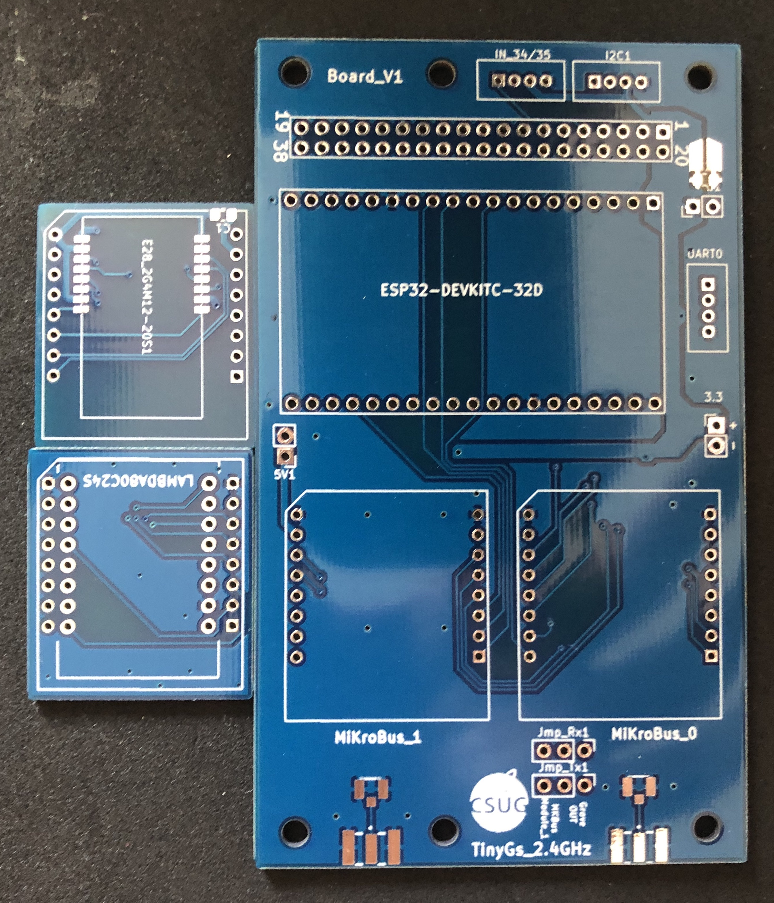
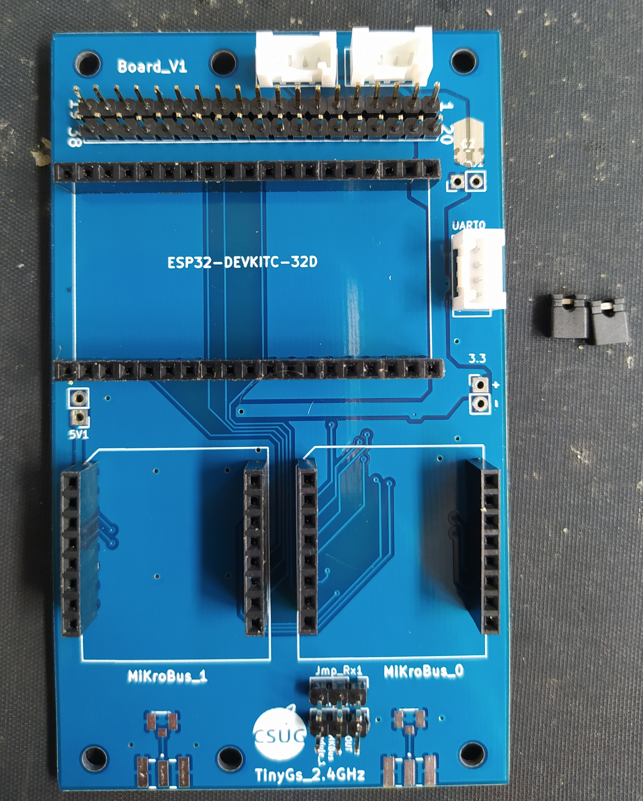

# TinyGS :: 2.4 GHz LoRa ground station

Project to develop a ground station board that will receive messages from satellite on the 2.4GHz band. Satellite tracks are [Thingsat@STORK1](https://tinygs.com/satellite/ThingSat) and other cubeseat followed by the TinyGS community.
This Git contains Hardware and software of a TinyGS 2.4 GHz LoRa ground station https://tinygs.com/.

For the long-range communication, we will use the Semtech SX1280, which is a low power 2.4 GHz LoRa RF Transceiver. We will use this technology through modules [E28](https://www.amazon.com/Ebyte-%C3%89metteur-r%C3%A9cepteur-Bluetooth-E28-2G4M12S-%C3%A9metteur/dp/B07P2BZW5C) and [Lamda80](https://fr.farnell.com/rf-solutions/lambda80-24s/transceiver-2mbps-2-5ghz/dp/2988571).

Project contains several PCBs and firmwares. 

## Todolist
* [x] PCB for ESP32 Vroom + 2 Mikrobus modules + 3 groves connectors (RXTX,I2C,ANA)
* [ ] PCB for ESP32 Vroom + 2 Mikrobus modules + 3 groves connectors (RXTX,I2C,ANA) + H-Bridges for driving stepper + Power supply
* [x] Mikrobus adapter for EByte E28 SX1280 module
* [x] Mikrobus adapter for Lambda80 SX1280 module 
* [ ] Mikrobus adapter for [Miromico FMLR STM SX1280 module](https://miromico.ch/portfolio/fmlr-8x-x-stlx/?lang=en) 
* [ ] TinyGS firmware for ESP32 Vroom + E28 module
* [ ] TinyGS firmware for ESP32 Vroom + Lambda80 module
* [ ] TinyGS firmware for ESP32 Vroom + [Miromico FMLR STM SX1280 module](https://miromico.ch/portfolio/fmlr-8x-x-stlx/?lang=en)
* [ ] Power consumption study with [X-NUCLEO-LPM01A](https://www.st.com/en/evaluation-tools/x-nucleo-lpm01a.html)
* [ ] RIOTOS firmware for ESP32 Vroom + Lambda80 module (cubesat emulator)

###  About hardware
PCB are made to integrate up to 2 Mikrobus modules including SX1280 technology. Mikrobus board is an add-on board socket standard made by [mikroe](https://www.mikroe.com/mikrobus). This makes the ground station adjustable and modular.
 

There are 2 different PCB version:
* Board_Tinysgs_2.4GHz_V1, which contains: ESP32 Vroom + 2 Mikrobus modules + Grove connectors (RXTX,I2C,ANA)
* Board_Tinysgs_2.4GHz_V2, which contains: ESP32 Vroom + 2 Mikrobus modules + Grove connectors (RXTX,I2C) + H-Bridges for driving stepper + Power supply

We made the board as modular as possible. It is possible to implement all modules as desired, as long as it respects the Mikrobus pin specification. Mikrobus module are connected by SPI, I2C, UART and more GPIO. They are both supplied by 3V and Mikrobus_1 is also supplied by 5V if desired. 2 SMA connector mount edge are available on board. Theyre a connected to a SMA male connector, which allows to plug any signal that we want through a SMA female connector.

Both Mikrobus boards are connected to the ESP 32 by SPI. They are using the same SPI bus (SPI_0).

A [Power Bank NCR18650B Battery shield](https://www.amazon.com/Diymore-Lithium-Battery-Charging-Arduino/dp/B07SZKNST4) made for Arduino and ESP32 can be plugged under the board using the 4 screw holes.

PCB are made on [KiCad](https://www.kicad.org/), which is a free software for electronics circuit board design. PCBs has been manufactered by [JLCPCB](https://jlcpcb.com/).

###  About software

### Media
Here the picture of the board_V1, with or without modules. On last picture, a GPS, a magnetometer and a joystick are connected by grove connection.

